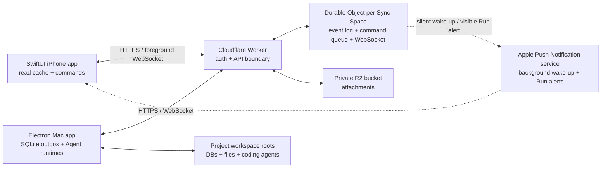

# iOS Companion architecture

## Decision

Build the companion as a native SwiftUI app. Keep every Agent runtime, shell command, database connection, project credential, and workspace mutation on the Mac. The iPhone owns presentation, a read cache, attachment previews, and a constrained command queue.

React Native is technically viable: React Navigation's Native Stack uses `UINavigationController` on iOS and supports native headers, large titles, search bars, gestures, and form sheets. It is not the preferred choice here because this client is iOS-only and its highest-risk surfaces—APNs background delivery, Keychain, Quick Look, file caching, and platform navigation—are already native. A React Native layer would mainly reuse TypeScript types, not the Electron UI or main-process services. See [React Navigation Native Stack](https://reactnavigation.org/docs/native-stack-navigator/).

## Runtime topology



The canonical relay is `https://fuddy.ai/api/relay`; the previous `workers.dev` route remains available for already-installed clients. It uses one Durable Object per account-owned Sync Space, the Hibernation WebSocket API, SQLite-backed ordered events and commands, and a private R2 bucket. Cloudflare recommends Hibernation because the object can sleep while clients remain connected: [Durable Objects WebSockets](https://developers.cloudflare.com/durable-objects/best-practices/websockets/).

## Consistency model

The Mac database is authoritative.

1. A Mac mutation writes the application record and a `companion_sync_outbox` event to local SQLite.
2. `CompanionSyncService` reads pending events in insertion order and uploads them in batches of at most 100 events / 512 KiB. Each batch is authenticated once and written by one Durable Object SQLite transaction; failed events remain in the outbox with attempt count and error.
3. The Durable Object assigns a monotonic sequence number and broadcasts the event.
4. iOS asks for `events?after=<lastSequence>`, applies idempotent upserts, then atomically saves its cache.
5. A phone action creates a command with a client UUID. The Mac stores that command before execution, so reconnects cannot execute a terminal command twice. Every command transition is monotonic, and each update is also persisted to the ordered event log so an offline phone can recover completion or failure.
6. Mac execution writes normal application mutations, which return through the same outbox as evidence of the result.

The WebSocket is a wake-up hint, not the source of truth. A committed batch emits one content-free `sync.available(lastSequence)` hint, and both clients replay the ordered HTTP event log after reconnecting, on launch or foreground activation, and when the user refreshes. While connected, Mac and foreground iOS use a five-minute replay fallback; while disconnected they return to a 60-second fallback. Both clients send an application-level heartbeat every 20 seconds; one missed `pong` discards the stale socket and starts the 5, 15, then 60-second reconnect backoff instead of leaving a half-open connection marked as healthy. When iOS enters the background it explicitly cancels the fallback timer and closes the socket; foreground activation reconnects and immediately replays from the last persisted sequence.

Mac keeps complete Agent tool output only in its authoritative local database. Snapshot and incremental Relay payloads retain the tool name and terminal status, normalize whitespace, remove native metadata/arguments, and cap the displayed summary at 600 characters. User messages, assistant answers, and provider-supported reasoning summaries continue to replay normally; raw private chain-of-thought is never part of the protocol.

Every phone chat is projected into the same stable `CompanionChatRecord` block stream. An initial Sync Space snapshot includes only the newest 100 display blocks for Work Assistant and for each Agent Run, ordered oldest-to-newest so the shared timeline can open at the latest message. Reaching the top sends the constrained `chat.load-history` command with a stable `before` record cursor; Mac returns at most 100 complete earlier blocks through the encrypted command result. A process block is never split between pages, even when it contains several reasoning/tool events. iOS merges the page by record ID and preserves the visible scroll target while Mac remains authoritative for the full history.

Each event page and WebSocket presence frame also carries current Durable Object presence. The iPhone updates presence directly from `sync.ready` and `presence.updated`, and distinguishes “Relay unreachable” from “Relay connected but Mac offline”; commands may still be queued in the second state and will execute when the Mac reconnects. The Mac settings UI reports HTTP replay and realtime WebSocket health separately so a successful replay cannot hide a stale socket.

## Account authorization and authentication

- Mac and iPhone must first establish independent Fuddy account sessions. The Account API registers each installation as a revocable device and creates one Sync Space per Mac host.
- After iPhone login, it restores its previous Sync Space or chooses the most recently online space, generates a device P-256 key, and creates an enrollment request. There is no QR or manual pairing step in the current UI.
- The online Mac validates the same-account enrollment and uses ECDH, HKDF-SHA256 and AES-256-GCM to wrap the Relay token and Space Data Key for that specific iPhone public key. The Account API stores only the opaque wrapped grant.
- iOS stores account tokens, its device private key and Relay credentials in Keychain with device-only accessibility; Mac stores its session, private key and Relay token in the credential vault/macOS Keychain path.
- Durable Object storage contains only SHA-256 token hashes. Tokens, Space Data Keys and account refresh tokens are never logged or stored in application SQLite.
- Every Relay operation requires Sync Space ID, device ID and bearer token. Role checks ensure only Mac can append authoritative events or complete commands, while only iOS can create commands.
- Revoking a device or Sync Space through the Account API directly revokes Relay access through a private Service Binding. A stale device token receives `401` afterward.
- The legacy one-time pairing endpoints remain deployed only so older installed clients can upgrade without losing access. New Mac and iOS interfaces neither create nor scan pairing QR codes.

Current transport uses HTTPS, private Cloudflare storage and application-layer AES-256-GCM encryption so Cloudflare stores opaque event and attachment ciphertext. Abuse protection, account deletion and active Space Data Key rotation remain release gates for untrusted multi-user distribution.

Relay keeps the latest encrypted snapshot as the recovery baseline and rolls incremental history at 5,000 events per account. A new snapshot immediately removes everything before it; when the rolling window fills later, the oldest post-snapshot increments are removed while the baseline remains available. Relay records the trimmed sequence boundary, and a client cursor that falls inside the resulting gap is reset to replay that snapshot before applying retained increments. Commands are capped at 1,000 rows and reclaim the oldest terminal rows before rejecting new work; reclaimed command IDs remain as bounded tombstones so a retried request cannot execute twice. R2 attachments remain until the Mac disconnects the account; longer-lived multi-user rollout still needs product-level attachment retention and garbage-collection controls.

## Foreground and background delivery

While iOS is active, `URLSessionWebSocketTask` receives immediate event notifications and the app replays the event log. A WebSocket is not a reliable suspended-app channel. The relay therefore sends a collapsed, content-free background notification only to iOS devices without an active socket. iOS then fetches the event log; invalid or unregistered APNs tokens are removed after provider rejection.

Each terminal Agent turn adds one `agent-turn.settled` event after the Run transitions from `running` to `idle` or `failed`. Its stable turn ID is the triggering user-message ID, so Relay retries remain idempotent. The Mac displays a local notification; Relay converts the same event into an APNs alert for every registered iPhone, including a foreground device. The alert contains only the Run title, Run ID, turn ID, and replay sequence. Tapping it replays events and opens the matching Run; full messages and tool output never enter the APNs payload. User-initiated stops intentionally do not produce a completion alert.

Apple explicitly treats background notifications as low priority and does not guarantee delivery; they can be throttled. Therefore the app always refreshes on foreground entry and manual pull-to-refresh as well. See [Pushing background updates to your app](https://developer.apple.com/documentation/usernotifications/pushing-background-updates-to-your-app).

APNs requires an Apple Developer team and a `.p8` key. The non-secret Team ID, Key ID, topic, and APNs environment live in `cloud/relay/wrangler.jsonc`; only the private key is stored as a Cloudflare Worker secret:

```bash
cd cloud/relay
npx wrangler secret put APNS_PRIVATE_KEY
```

Set `APNS_ENVIRONMENT` to `development` for locally signed development builds and change it to `production` before deploying a Relay used by TestFlight/App Store builds. The APNs key itself supports both environments. Without the required private-key secret, deployment is rejected; foreground realtime and ordered replay do not depend on APNs.

## Images and attachments

Agent-generated files already become `AgentRunArtifact` records on Mac. Work Assistant image attachments use the same transport instead of syncing their inline `data:` URLs. During sync:

1. Mac first resolves project artifacts inside the registered project file space, then falls back to the Run working directory for coding-Agent artifacts; both paths enforce containment and reject missing files, directories, and traversal attempts.
2. Files up to 20 MiB including the encryption envelope are streamed to a private R2 object under the account ID. The initial pairing snapshot uploads existing Run artifacts too, so historical Sessions are not display-only.
3. The event contains filename, MIME type, size, SHA-256, and artifact linkage; it never exposes a local Mac path as a downloadable URL.
4. iOS downloads with its device token, verifies the expected byte length and SHA-256 before moving the file into Caches, and opens the local file with Quick Look. Image, PDF, text, and video types use native previews.

The initial pairing snapshot still uploads descriptors and bytes for historical artifacts. If an artifact descriptor is missing later, the Session's “信息与文件” Modal sends the persisted `artifact.request-upload` command. An online Mac resolves and streams that one file, then returns its verified descriptor through the durable `command.updated` event; WebSocket delivery is only the fast wake-up path and ordered replay remains the fallback. The chat timeline itself does not duplicate the artifact list.

The local path remains visible only as descriptive metadata. R2 objects are not public and cannot be enumerated without a valid paired device token. iOS preserves the original filename extension in its private cache so Quick Look can select the correct native previewer.

## Native application structure

- `CompanionStore`: main-actor state, event reducer, command methods, polling, and atomic offline cache.
- `RelayClient`: pairing, authenticated REST calls, WebSocket wake-ups, push-token registration, and attachment downloads.
- `KeychainStore`: device credentials.
- `CompanionChatTimeline`: shared bounded history, upward pagination, latest-message anchoring, scroll restoration, and new-message following for every chat.
- `WorkAssistantView`: thin Work Assistant configuration over the shared timeline and constrained remote message command.
- `RunsListView` / `RunDetailView`: persistent Session list and Agent-specific configuration over the same timeline; active runs show a spinner; tool calls use collapsed `DisclosureGroup` rows; Session metadata and artifacts live in the top-right “信息与文件” Modal instead of the message timeline.
- `DecisionListView`: inbox and constrained status commands.
- `ProjectDetailView`: project status, goals, progress, and milestones from the same Mac snapshot/event log.
- `ArtifactRow`: authenticated download and `QLPreviewController` presentation.
- `CompanionAppDelegate`: APNs authorization, device-token registration, foreground presentation, background update, and notification-to-Run navigation bridge.

The deployment target is iOS 17. The project is generated with XcodeGen from `ios/project.yml` so target settings and file membership remain reviewable.

## What is shared with the Mac app

| Area | Reuse |
| --- | --- |
| Domain meaning and wire protocol | Shared versioned contract manifest; Swift event/command enums, command payloads, Snapshot and non-entity event payloads are generated, while complete nested Zod schemas validate Relay writes and a generated fingerprint guards core DTO declarations |
| Cloud relay API | Fully shared by both clients |
| SQLite schema and Electron services | Mac only; iOS has a deliberately smaller JSON read cache |
| React components and CSS | Not reused |
| Agent runtime adapters, zsh environment, workspace tools | Mac only |
| Product terminology, information hierarchy, visual behavior | Reimplemented natively in SwiftUI |
| Attachments | Shared object metadata and R2 bytes; Mac uploads, iOS caches/previews |

Snapshot and non-entity event DTOs are generated alongside command payloads. Entity events deliberately reuse their domain models, while the TypeScript contract distinguishes local outbox messages from Relay wire messages—for example, local Work Assistant image data becomes authenticated attachment descriptors before transport. Remaining handwritten Swift domain presentation models may migrate incrementally, but runtime code should not be shared merely to avoid small models and execution authority must remain visibly separated.

## Build and verification

```bash
# Cloud relay
npm --prefix cloud/relay run typecheck
npm --prefix cloud/relay test
npm --prefix cloud/relay run smoke

# Regenerate iOS project
brew install xcodegen
npm run ios:generate

# Regenerate and verify shared Companion wire contracts/fingerprint
npm run generate:companion-contracts
npm run check:companion-contracts

# Swift 6 typecheck for the app and XCTest sources; this works before accepting
# the local Xcode license because it invokes the installed toolchain directly.
npm run ios:typecheck

# Build and run XCTest after accepting the local Xcode license and installing an
# iOS Simulator runtime. Keep local ad-hoc signing enabled: the Keychain APIs used
# by pairing require the generated application identifier entitlement.
cd ios
DEVELOPER_DIR=/Applications/Xcode.app/Contents/Developer \
  xcodebuild -project ProjectAgentCompanion.xcodeproj \
  -scheme ProjectAgentCompanion \
  -destination 'platform=iOS Simulator,name=iPhone 17 Pro' \
  build

DEVELOPER_DIR=/Applications/Xcode.app/Contents/Developer \
  xcodebuild test \
  -project ProjectAgentCompanion.xcodeproj \
  -scheme ProjectAgentCompanion \
  -destination 'platform=iOS Simulator,name=iPhone 17 Pro'
```

Device/APNs verification additionally requires selecting an Apple Developer team, enabling Push Notifications for the app identifier, and installing a development provisioning profile.
